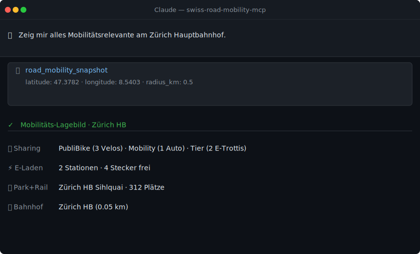

> **Part of the [Swiss Public Data MCP Portfolio](https://github.com/malkreide)**

# Swiss Road & Mobility MCP Server


[](https://opensource.org/licenses/MIT)
[](https://www.python.org/downloads/)
[](https://modelcontextprotocol.io/)


> MCP Server for Swiss road mobility — shared vehicles, EV charging, traffic alerts, Park & Rail, and multimodal trip planning

[Deutsche Version](README.de.md)

---

## Demo



---

## Overview

`swiss-road-mobility-mcp` provides AI-native access to Swiss road and mobility data sources:

| Source | Data | API | Auth |
|--------|------|-----|------|
| **sharedmobility.ch** | Bikes, e-scooters, cars (GBFS) | REST/JSON | None |
| **ich-tanke-strom.ch** | EV charging stations | GeoJSON | None |
| **opentransportdata.swiss** | Traffic events, counting stations | DATEX II / SOAP+XML | Free key |
| **data.sbb.ch** | Park & Rail facilities | REST/JSON (Opendatasoft) | None |
| **transport.opendata.ch** | Public transport connections | REST/JSON | None |
| **geo.admin.ch** | Address geocoding, road classification | REST/JSON | None |

If the Swiss Transport MCP is the GA pass for rail, this server is the vignette + Park & Rail card + sharing subscription for the road — together they paint the complete multimodal picture of Swiss mobility.

**Anchor demo query:** *"I'm in Dietikon with my car. I need to get to Bern. Where can I park? Which train should I take?"*

---

## Features

- **15 tools** across six data sources (Phase 1–4)
- **`road_mobility_snapshot`** — aggregated mobility overview for any location
- **`road_multimodal_plan`** — car + Park & Rail + public transport in one plan
- No API key required for 12 of 15 tools
- Dual transport — stdio (Claude Desktop) + SSE (cloud)
- Rate limiting + caching for all endpoints

---

## Prerequisites

- Python 3.11+
- [uv](https://github.com/astral-sh/uv) (recommended) or pip

---

## Installation

```bash
# Clone the repository
git clone https://github.com/malkreide/swiss-road-mobility-mcp.git
cd swiss-road-mobility-mcp

# Install
pip install -e .
# or with uv:
uv pip install -e .
```

Or with `uvx` (no permanent installation):

```bash
uvx swiss-road-mobility-mcp
```

---

## Quickstart

```bash
# stdio (for Claude Desktop)
swiss-road-mobility-mcp
# or:
python -m swiss_road_mobility_mcp.server

# SSE (for cloud / Render.com)
MCP_TRANSPORT=sse MCP_PORT=8001 swiss-road-mobility-mcp
```

Try it immediately in Claude Desktop:

> *"Show me everything mobility-related at Zurich HB."*
> *"Find shared bikes near Bern Bahnhof."*
> *"Where can I charge my EV near Lucerne?"*

---

## Configuration

### Claude Desktop

Edit `~/Library/Application Support/Claude/claude_desktop_config.json` (macOS) or `%APPDATA%\Claude\claude_desktop_config.json` (Windows):

```json
{
  "mcpServers": {
    "swiss-road-mobility": {
      "command": "uvx",
      "args": ["swiss-road-mobility-mcp"],
      "env": {
        "OPENTRANSPORTDATA_API_KEY": "<your-token>"
      }
    }
  }
}
```

Or with `python`:

```json
{
  "mcpServers": {
    "swiss-road-mobility": {
      "command": "python",
      "args": ["-m", "swiss_road_mobility_mcp.server"],
      "env": {
        "OPENTRANSPORTDATA_API_KEY": "<your-token>"
      }
    }
  }
}
```

> Shared mobility, EV charging, Park & Rail, and the multimodal planner work **without** an `OPENTRANSPORTDATA_API_KEY`. The key is only required for the DATEX II traffic tools.

**Config file locations:**
- macOS: `~/Library/Application Support/Claude/claude_desktop_config.json`
- Windows: `%APPDATA%\Claude\claude_desktop_config.json`

### Cloud Deployment (SSE for browser access)

For use via **claude.ai in the browser** (e.g. on managed workstations without local software):

**Render.com (recommended):**
1. Push/fork the repository to GitHub
2. On [render.com](https://render.com): New Web Service -> connect GitHub repo
3. Set start command: `MCP_TRANSPORT=sse MCP_PORT=8001 swiss-road-mobility-mcp`
4. In claude.ai under Settings -> MCP Servers, add: `https://your-app.onrender.com/sse`

---

## Available Tools

### Shared Mobility & EV Charging (no API key required)

| Tool | Description | Cache |
|------|-------------|-------|
| `road_find_sharing` | Shared mobility nearby (bikes, e-scooters, cars) | 60s |
| `road_search_sharing` | Search sharing stations by name | 5min |
| `road_sharing_providers` | All sharing providers in Switzerland | 1h |
| `road_find_charger` | EV charging stations nearby | 5min |
| `road_charger_status` | Real-time availability of charging stations | 1min |
| `road_check_status` | Server & API health check | - |

### Traffic (free API key required)

| Tool | Description | Cache |
|------|-------------|-------|
| `road_traffic_situations` | Accidents, roadworks, congestion from ASTRA/VMZ-CH | 2min |
| `road_traffic_counters` | Vehicles/h + km/h at counting stations near a position | 1min |
| `road_counter_sites` | List counting stations nearby | 24h |

### Park & Rail + Multimodal (no API key required)

| Tool | Description | Cache |
|------|-------------|-------|
| `road_park_rail` | Find SBB Park+Rail facilities nearby | 5min |
| `road_mobility_snapshot` | Complete mobility overview for a location | - |
| `road_multimodal_plan` | Plan car -> Park+Rail -> public transport -> destination | - |

### Geography & Addresses — Phase 4 (no API key required)

| Tool | Description | Cache |
|------|-------------|-------|
| `road_geocode_address` | Swiss address -> GPS (official building address register) | - |
| `road_reverse_geocode` | GPS -> official address with EGID/EGAID (GWR) | - |
| `road_classify_road` | Road classification via swissTLM3D | - |

### Example Use Cases

| Query | Tool |
|-------|------|
| *"Find shared bikes near Zurich HB"* | `road_find_sharing` |
| *"Where can I charge my EV near Bern?"* | `road_find_charger` |
| *"Any traffic incidents on the A1?"* | `road_traffic_situations` |
| *"Where can I park near Winterthur station?"* | `road_park_rail` |
| *"Plan my trip from Dietikon to Bern by car + train"* | `road_multimodal_plan` |

---

## API Key for Traffic Tools

1. Register: <https://api-manager.opentransportdata.swiss>
2. Create a new application -> subscribe to the "Strassenverkehr" API
3. Copy the token

```bash
export OPENTRANSPORTDATA_API_KEY=<your-token>
```

Without a key, the traffic tools return a descriptive error message including the exact registration link — no crash.

---

## Architecture

```
swiss_road_mobility_mcp/
├── server.py             # FastMCP server, 15 tools
├── api_infrastructure.py # Rate limiter, cache, HTTP client, geo utilities
├── shared_mobility.py    # sharedmobility.ch
├── ev_charging.py        # ich-tanke-strom.ch
├── traffic_situations.py # DATEX II traffic alerts (SOAP/XML)
├── traffic_counters.py   # DATEX II counting stations (SOAP/XML)
├── park_rail.py          # SBB Open Data Park & Rail
├── multimodal.py         # Snapshot + trip planner (cross-source)
└── geo_admin.py          # geo.admin.ch geocoding + road classification
```

### Data Source Characteristics

| Source | Protocol | Coverage | Auth |
|--------|----------|----------|------|
| sharedmobility.ch | REST/JSON (GBFS) | All CH sharing providers | None |
| ich-tanke-strom.ch | GeoJSON | All public EV chargers | None |
| opentransportdata.swiss | DATEX II / SOAP+XML | ASTRA traffic data | Free key |
| data.sbb.ch | REST/JSON (Opendatasoft) | SBB Park & Rail | None |
| transport.opendata.ch | REST/JSON | Public transport schedules | None |
| geo.admin.ch | REST/JSON | Official addresses, roads | None |

---

## Project Structure

```
swiss-road-mobility-mcp/
├── src/swiss_road_mobility_mcp/
│   ├── __init__.py              # Package
│   ├── server.py                # FastMCP server, 15 tools
│   ├── api_infrastructure.py    # Rate limiter, cache, HTTP client
│   ├── shared_mobility.py       # Shared vehicles
│   ├── ev_charging.py           # EV charging stations
│   ├── traffic_situations.py    # Traffic events
│   ├── traffic_counters.py      # Vehicle counting
│   ├── park_rail.py             # Park & Rail
│   ├── multimodal.py            # Snapshot + trip planning
│   └── geo_admin.py             # Geocoding + roads
├── tests/
│   ├── test_integration.py      # Live API tests
│   └── test_phase3.py           # Park & Rail + multimodal tests
├── .github/workflows/ci.yml     # GitHub Actions (Python 3.11/3.12/3.13)
├── pyproject.toml
├── CHANGELOG.md
├── CONTRIBUTING.md
├── LICENSE
├── README.md                    # This file (English)
└── README.de.md                 # German version
```

---

## Known Limitations

- **Shared Mobility:** The `sharedmobility.ch` API does not enforce strict radius filtering; vehicles slightly outside the specified radius may appear
- **EV Charging:** Station naming conventions vary between operators; some stations may appear without detailed names
- **Traffic (DATEX II):** Requires a free API key; without it, traffic tools return helpful error messages
- **Park & Rail:** SBB occasionally renames endpoints; the server includes a fallback chain
- **Multimodal Planner:** Response time depends on the slowest of the queried sources

---

## Testing

```bash
# All tests
pytest tests/ -v

# Quick check (without pytest)
python tests/test_phase3.py
```

---

## Safety & Limits

- **Read-only:** All tools perform HTTP GET requests only — no data is written, modified, or deleted on any upstream system.
- **No personal data:** Location coordinates passed as tool inputs are not stored, logged, or forwarded beyond the immediate API request. API responses contain no PII — only vehicle counts, charger availability, traffic events, and geographic metadata.
- **Rate limiting:** The server enforces client-side rate limits (Shared Mobility: 30 req/60s; EV Charging: 10 req/60s) to protect upstream APIs. The DATEX II key is subject to opentransportdata.swiss fair-use terms.
- **Caching:** Responses are cached in-process (Sharing: 60s · EV: 5 min · Park+Rail: 5 min · Traffic: 1–2 min). Real-time data reflects the cache age, not necessarily the current second.
- **Terms of service:** Data is subject to the ToS of each upstream source — [sharedmobility.ch](https://sharedmobility.ch), [ich-tanke-strom.ch](https://ich-tanke-strom.ch), [opentransportdata.swiss](https://opentransportdata.swiss), [data.sbb.ch](https://data.sbb.ch) (CC BY), [geo.admin.ch](https://www.geo.admin.ch/de/geo-dienstleistungen/geodienste/terms-of-use.html) (BGDI).
- **No guarantees:** This server is an independent community project, not affiliated with SBB, ASTRA, sharedmobility.ch, or any API provider. Availability depends on upstream services.

---

## Changelog

See [CHANGELOG.md](CHANGELOG.md)

---

## Contributing

See [CONTRIBUTING.md](CONTRIBUTING.md)

---

## License

MIT License — see [LICENSE](LICENSE)

---

## Author

Hayal Oezkan · [malkreide](https://github.com/malkreide)

---

## Credits & Related Projects

- **sharedmobility.ch:** [sharedmobility.ch](https://sharedmobility.ch/) — Swiss shared mobility platform
- **ich-tanke-strom.ch:** [ich-tanke-strom.ch](https://ich-tanke-strom.ch/) — Swiss EV charging network
- **ASTRA / opentransportdata.swiss:** [opentransportdata.swiss](https://opentransportdata.swiss/) — Federal traffic data
- **SBB Open Data:** [data.sbb.ch](https://data.sbb.ch/) — Swiss Federal Railways
- **geo.admin.ch:** [geo.admin.ch](https://api3.geo.admin.ch/) — Federal geospatial services
- **Protocol:** [Model Context Protocol](https://modelcontextprotocol.io/) — Anthropic / Linux Foundation
- **Related:** [swiss-transport-mcp](https://github.com/malkreide/swiss-transport-mcp) — Public transport (trains, buses, trams)
- **Related:** [zurich-opendata-mcp](https://github.com/malkreide/zurich-opendata-mcp) — 900+ datasets from the City of Zurich
- **Portfolio:** [Swiss Public Data MCP Portfolio](https://github.com/malkreide)
